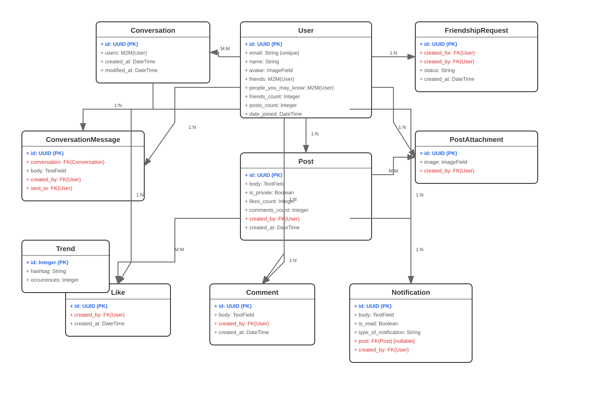

# 🌟 Frenzo — Modern Social Media Platform

Welcome to **Frenzo** — a modern social media platform designed for seamless interaction, built with cutting-edge technologies for both its frontend and backend.

This repository contains the complete codebase for Frenzo, encompassing a powerful **Django REST Framework API** and a dynamic **Vue 3 + Vite frontend**.

---

## 🚀 Project Overview

Frenzo aims to provide a robust and scalable social media experience, featuring:

* **User Authentication:** Secure JWT-based authentication for all user interactions.
* **User Accounts:** Comprehensive user profiles and management.
* **Posts & Interactions:** Create, like, and comment on posts.
* **Real-time Chat:** A dedicated messaging system for connected users.
* **Notifications:** Stay updated with activity relevant to your account.
* **Search Functionality:** Easily find users, posts, and more.
* **Media Uploads:** Support for images and other media content.
* **Content Moderation:** Automated NSFW image detection to keep uploaded media safe.

---

## ⚙️ Monorepo Structure

```
frenzo/
├── backend/             # Django REST Framework API
│   ├── account/
│   ├── post/
│   ├── chat/
│   ├── notification/
│   ├── search/
│   ├── moderation/      # NSFW image detection
│   ├── backend/
│   ├── media/
│   ├── manage.py
│   ├── Dockerfile
│   ├── .dockerignore
│   ├── .env
│   └── requirements.txt
├── frontend/            # Vue 3 + Vite Application
│   ├── public/
│   ├── src/
│   │   ├── assets/
│   │   ├── components/
│   │   ├── pages/
│   │   ├── router/
│   │   ├── store/
│   │   └── main.js
│   ├── Dockerfile
│   ├── .dockerignore
│   ├── index.html
│   ├── package.json
│   ├── tailwind.config.js
│   └── vite.config.js
├── docker-compose.yml
└── README.md            # This file
```

> **Note:** Adjust the `moderation/` app path above if your NSFW detection logic lives inside an existing app (e.g. `post/`) rather than its own app.

---

## 🗂 Database Schema

### UML Class Diagram



For an interactive version with zoom and pan capabilities: *Interactive UML Diagram (Coming Soon)*

### Core Models
- **User** — Main user entity with authentication and profile data
- **Post** — User-generated content with privacy controls
- **Comment** — Comments on posts
- **Like** — Like interactions on posts

### Communication Models
- **Conversation** — Private messaging between users
- **ConversationMessage** — Individual messages in conversations
- **FriendshipRequest** — Friend request management

### Support Models
- **Notification** — System notifications for users
- **PostAttachment** — File attachments for posts, includes moderation status
- **Trend** — Trending hashtags tracking

---

## 🛡️ Content Moderation (NSFW Detection)

Frenzo automatically screens uploaded images to keep the platform safe, using **opennsfw2** for on-upload NSFW classification.

**How it works:**
1. When a user uploads an image (post/profile media), the image is passed through the NSFW detection model before it's saved.
2. The model returns a probability score indicating how likely the image is to contain unsafe content.
3. If the score crosses the configured threshold, the upload is blocked and the user receives an error response instead of the image being published.
4. Clean images proceed through the normal upload pipeline and are stored as usual.

**Configuration:**
```python
NSFW_DETECTION_THRESHOLD = 0.8  # Adjust sensitivity as needed
```

> ⚠️ Update this section with your actual threshold value, model version, and whether moderation runs synchronously on upload or asynchronously via a background task — this is a placeholder based on a typical opennsfw2 integration.

---

## 🚀 Getting Started (Overall Setup)

This method uses Docker Compose to set up both the backend API, the frontend application, and a PostgreSQL database with a single command.

1. **Prerequisites:** Ensure you have [Docker](https://www.docker.com/products/docker-desktop/) and [Docker Compose](https://docs.docker.com/compose/install/) installed.

2. **Set up Environment Variables:**

   * Navigate to the `backend/` directory.
   * Copy the example environment file:

     ```bash
     cp .env.example .env
     ```
   * You can now configure your `backend/.env` file. The provided `docker-compose.yml` is pre-configured to use PostgreSQL, so no changes are needed for the default setup.

3. **Build and Run the Containers:**

   * From the root `frenzo/` directory, build the images and start the containers without running migrations yet:

     ```bash
     docker compose up --build -d
     ```

4. **Run Database Migrations:**

   ```bash
   docker compose exec backend python manage.py makemigrations
   docker compose exec backend python manage.py migrate
   ```

5. **Restart the Containers (Optional but recommended):**

   ```bash
   docker compose restart backend
   ```

6. **Access the Application:**

   * Backend API: **[http://localhost:8000](http://localhost:8000)**
   * Frontend application: **[http://localhost:5173](http://localhost:5173)**

7. **Create a Superuser (Optional):**

   ```bash
   docker compose exec backend python manage.py createsuperuser
   ```

8. **Stopping the Services:**

   * Press `Ctrl+C` in the terminal running `docker compose up`, or run:

     ```bash
     docker compose down -v
     ```

---

### 💻 Manual Setup (Alternative)

For developers who prefer to set up the environment directly on their machine.

1. **Set up the Backend** — see the Backend Installation section below.
2. **Set up the Frontend** — see the Frontend Installation section below.

Once both are set up and running, the frontend at `http://localhost:5173` will automatically connect to the backend at `http://127.0.0.1:8000`.

---

# 🧠 Frenzo Backend — Powered by Django REST Framework

This is the **backend** for Frenzo, built with **Django 4.2** and **Django REST Framework**. It provides a robust and scalable API for all social media functionalities.

## 📦 Backend Tech Stack

* **Python 3.10+**
* **Django 4.2**
* **Django REST Framework**
* **SimpleJWT** (for JWT authentication)
* **Pillow** (for robust image handling)
* **opennsfw2** (for NSFW image content moderation)
* **CORS Headers** (for cross-origin resource sharing)
* **SQLite** (default database for local development) / **PostgreSQL** (used via Docker Compose)

## ⚙️ Backend Installation & Setup

1. **Navigate to the Backend Directory:**
   ```bash
   cd backend
   ```

2. **Create a Virtual Environment:**
   ```bash
   python -m venv venv
   source venv/bin/activate   # On Windows: venv\Scripts\activate
   ```

3. **Install Dependencies:**
   ```bash
   pip install -r requirements.txt
   ```

4. **Apply Migrations:**
   ```bash
   python manage.py migrate
   ```

5. **Create a Superuser:**
   ```bash
   python manage.py createsuperuser
   ```

6. **Run the Development Server:**
   ```bash
   python manage.py runserver
   ```
   The backend API will be accessible at: **http://127.0.0.1:8000**

## 🔑 Backend API Authentication (JWT)

Frenzo uses **JWT (JSON Web Tokens)** via `djangorestframework-simplejwt`.

### Endpoints

| Endpoint               | Method | Description                    |
| :---------------------- | :----- | :------------------------------ |
| `/api/token/`           | `POST` | Get access and refresh tokens   |
| `/api/token/refresh/`   | `POST` | Refresh access token            |

### Header Format

Include your access token in the `Authorization` header for protected routes:
`Authorization: Bearer <your_access_token>`

### JWT Configuration

```python
SIMPLE_JWT = {
    'ACCESS_TOKEN_LIFETIME': timedelta(days=30),
    'REFRESH_TOKEN_LIFETIME': timedelta(days=180),
}
```

### 🌐 Backend CORS Configuration

```python
CORS_ALLOWED_ORIGINS = [
    "http://localhost:5173",  # Frontend URL
]
CORS_ALLOW_CREDENTIALS = True

CSRF_TRUSTED_ORIGINS = [
    "http://localhost:5173",  # Frontend URL
]
```

### 🖼 Backend Media & Static Files

Media uploads are handled using Pillow and screened through the NSFW moderation pipeline before being saved:

```python
MEDIA_URL = 'media/'
MEDIA_ROOT = BASE_DIR / 'media'
```

Files are served from `/media/` during development.

### 🛠 Backend Settings Summary

```python
DEBUG = True
ALLOWED_HOSTS = []
AUTH_USER_MODEL = 'account.User'
EMAIL_BACKEND = "django.core.mail.backends.console.EmailBackend"
TIME_ZONE = 'Asia/Kolkata'
```

### 📦 Backend `requirements.txt`

```
asgiref==3.6.0
Django==4.2
django-cors-headers==3.14.0
djangorestframework==3.14.0
djangorestframework-simplejwt==5.2.2
Pillow==9.5.0
PyJWT==2.6.0
pytz==2023.3
sqlparse==0.4.3
setuptools>=65.0.0
opennsfw2
```

> ⚠️ Add the pinned version of `opennsfw2` (and any supporting libraries like `tensorflow`/`onnxruntime` it depends on) once finalized.

### 🔐 Backend Security Notes

* ⚠️ **`SECRET_KEY` is hardcoded:** move this to an environment variable in production.
* ⚠️ **`DEBUG=True`:** switch to `False` when deploying to production.
* ✅ No sensitive keys exposed in this repository.

### 📌 Backend TODO / Improvements

* Add automated tests
* Switch to PostgreSQL in production
* Enable file storage (S3/GCS)
* Set up CI/CD (GitHub Actions)
* Document API with Swagger or Postman
* Move NSFW moderation to an async background task for large uploads

---

# 🌐 Frenzo Frontend — Vue 3 + Vite

This is the **frontend** for the Frenzo app, built with **Vue 3**, **Pinia**, **TailwindCSS**, and **Vite**. It delivers a fast, interactive UI that connects seamlessly to the Django REST API backend.

## ⚙️ Frontend Tech Stack

* ⚡ **Vue 3** — Progressive JavaScript framework
* 🌿 **Pinia** — State management
* 🎨 **TailwindCSS** — Utility-first CSS framework
* 🚀 **Vite** — Lightning-fast build tool
* 🌐 **Vue Router** — Client-side routing
* 🔗 **Axios** — For communicating with the backend API

## 🚀 Frontend Getting Started

1. **Navigate to the Frontend Directory:**
   ```bash
   cd frontend
   ```

2. **Install dependencies:**
   ```bash
   npm install
   ```

3. **Start development server:**
   ```bash
   npm run dev
   ```
   Your app will be running at: **http://localhost:5173**

## 🛠 Frontend Available Scripts

| Script             | Description                       |
| :------------------ | :---------------------------------- |
| `npm run dev`       | Start local development server      |
| `npm run build`     | Build for production                |
| `npm run preview`   | Preview production build locally    |

## 🔗 Frontend API Integration

Ensure your backend is running at `http://127.0.0.1:8000`. Authentication is handled via JWT stored securely. Axios is used for all HTTP requests to the API. If an image upload is rejected by the moderation check, the frontend surfaces the API's error response to the user.

## 🧪 Frontend Environment Configuration (Optional)

If needed, create a `.env` file in the `frontend/` directory to manage API base URLs or other secrets:

```
VITE_API_URL=http://127.0.0.1:8000
```

Use this variable in your Vue application via `import.meta.env.VITE_API_URL`.

### Key Dependencies

```json
"dependencies": {
  "axios": "^1.3.5",
  "pinia": "^2.0.32",
  "resend": "^4.6.0",
  "vue": "^3.2.47",
  "vue-router": "^4.1.6"
},
"devDependencies": {
  "@tailwindcss/forms": "^0.5.10",
  "@vitejs/plugin-vue": "^4.0.0",
  "autoprefixer": "^10.4.14",
  "postcss": "^8.4.21",
  "tailwindcss": "^3.3.1",
  "vite": "^4.1.4"
}
```

## 🎨 Frontend Styling

Frenzo's frontend is styled using **TailwindCSS** with the `@tailwindcss/forms` plugin for easy form styling. All custom styles reside within the `src/assets/` directory.

## 🔐 Frontend Security Notes

* ✅ No sensitive data committed directly into the repository.
* ✅ Safe to push to public GitHub.

---

## 👨‍💻 Author

Made with ❤️ by **Sahil Sonekar**

**GitHub:** [https://github.com/SahilSonekar](https://github.com/SahilSonekar)

**LinkedIn:** [https://www.linkedin.com/in/sahil-sonekar-837a7725b/](https://www.linkedin.com/in/sahil-sonekar-837a7725b/)