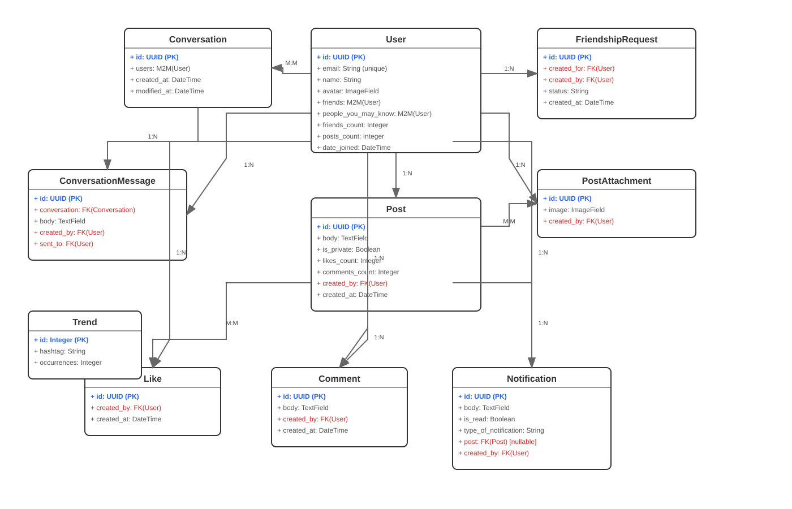

# 🌟 Frenzo — Social Media Platform

Frenzo is a full-stack social media platform built with **Django REST Framework** and **Vue 3**. It supports user authentication, posts, real-time chat via WebSockets, notifications, search, and automated NSFW image moderation.

---

## 📋 Features

- **JWT Authentication** — secure login, registration, and token refresh
- **User Profiles** — avatars, friend connections, and people-you-may-know suggestions
- **Posts** — create, like, unlike, comment, delete, and report posts; private post support
- **Real-Time Chat** — WebSocket-based messaging between connected users; messages are delivered instantly without polling
- **Notifications** — activity notifications for friend requests, likes, and comments
- **Search** — search for users and posts
- **Media Uploads** — image attachments on posts served through Django's media pipeline
- **NSFW Image Moderation** — uploaded images are screened via the Sightengine API before being published; explicit content is blocked at upload time

---

## 🏗️ Architecture

```
Vue Frontend (Vite · port 5173)
        │
        ├── REST API ──────────────────► Django REST Framework
        │                                        │
        └── WebSocket ─────────────────► Daphne / ASGI
                                                 │
                                          Django Channels
                                                 │
                                          ChatConsumer
                                                 │
                                              MySQL
```

The backend is served by **Daphne** (ASGI), which handles both ordinary HTTP requests and WebSocket connections on port 8000.

---

## 🗂️ Project Structure

```
frenzo/
├── backend/
│   ├── account/            # User model, auth, friend requests
│   ├── chat/
│   │   ├── models.py       # Conversation, ConversationMessage
│   │   ├── api.py          # REST chat endpoints
│   │   ├── consumers.py    # WebSocket ChatConsumer (JWT auth + broadcast)
│   │   ├── routing.py      # WebSocket URL routing
│   │   └── serializers.py
│   ├── notification/       # Notification model and API
│   ├── post/
│   │   ├── models.py       # Post, Comment, Like, Trend, PostAttachment
│   │   ├── api.py
│   │   └── moderation.py   # Sightengine NSFW detection
│   ├── search/             # User and post search
│   ├── scripts/            # Management utility scripts
│   ├── backend/
│   │   ├── settings.py
│   │   ├── urls.py
│   │   └── asgi.py         # ProtocolTypeRouter (HTTP + WebSocket)
│   ├── manage.py
│   ├── requirements.txt
│   ├── Dockerfile
│   └── .env.example
├── frontend/
│   ├── src/
│   │   ├── assets/
│   │   ├── components/
│   │   ├── views/          # ChatView, FeedView, ProfileView, etc.
│   │   ├── router/
│   │   ├── stores/         # Pinia user store
│   │   └── main.js
│   ├── index.html
│   ├── package.json
│   ├── tailwind.config.js
│   ├── vite.config.js
│   └── Dockerfile
├── docs/
│   └── uml-diagram.svg
├── docker-compose.yml
└── README.md
```

---

## 🗃️ Database Schema

### UML Class Diagram



### Core Models

| Model | App | Description |
|---|---|---|
| `User` | `account` | Custom user with email auth, avatar, friend list |
| `FriendshipRequest` | `account` | Friend request with sent/accepted/rejected status |
| `Post` | `post` | User post with body, privacy flag, like/comment counts |
| `PostAttachment` | `post` | Image attachment with NSFW score and flagged status |
| `Comment` | `post` | Comment on a post |
| `Like` | `post` | Like on a post |
| `Trend` | `post` | Tracked hashtag and occurrence count |
| `Conversation` | `chat` | 1-to-1 conversation between two users |
| `ConversationMessage` | `chat` | Individual message in a conversation |
| `Notification` | `notification` | Activity notification for a user |

---

## 💬 Real-Time Chat

Frenzo chat uses two complementary layers:

**REST API** — handles conversation creation, message history retrieval, and sending messages when a WebSocket connection is unavailable.

**WebSocket** — provides instant message delivery to all participants in a conversation without any polling.

### How it works

1. When a user opens a conversation, the frontend opens a WebSocket connection to:
   ```
   ws://localhost:8000/ws/chat/<conversation_id>/?token=<jwt_access_token>
   ```
2. **ChatConsumer** validates the JWT access token from the query string using the same `djangorestframework-simplejwt` library used by the REST APIs. An invalid or missing token closes the connection immediately (code `4001`).
3. **Membership is verified** — a user can only connect to a conversation they belong to. Knowing a conversation UUID is not enough; non-members are rejected (code `4003`).
4. When the user sends a message, the consumer saves it to MySQL using the existing `ConversationMessage` model (identical to the REST endpoint).
5. The saved message is **broadcast** to the channel group for that conversation, so every connected participant receives it in real time.
6. The frontend de-duplicates messages by ID so the sender's own message is not displayed twice.
7. When the user navigates away, the WebSocket closes cleanly and the consumer removes itself from the channel group.

### Channel layer

`InMemoryChannelLayer` is used, which is correct for a single-process Daphne deployment. If the application is scaled across multiple workers or processes, swap in `channels_redis.core.RedisChannelLayer` — no changes to the consumer are required.

### REST fallback

If the WebSocket connection is unavailable or still connecting, the frontend falls back to the existing REST endpoint (`POST /api/chat/<id>/send/`) automatically.

---

## 🔞 NSFW Image Moderation

When a user uploads an image (post attachment), it is checked against the **Sightengine nudity detection API** (`nudity-2.1` model) before being saved.

**How it works:**

1. The uploaded file is sent to the Sightengine API synchronously at upload time.
2. The API returns a nudity analysis. Only the three explicit-content categories are used to calculate the block score: `sexual_activity`, `sexual_display`, and `erotica`. Suggestive or contextual categories (swimwear, cleavage, etc.) are intentionally excluded to avoid false positives.
3. The block score is the maximum of those three values. If it reaches or exceeds **0.5**, the upload is rejected, the file is deleted, and the user receives an error response.
4. If the score is below the threshold, the image is saved and the post proceeds normally. The raw score is stored on `PostAttachment.nsfw_score` for reference.

**Configuration:** Sightengine API credentials are read from environment variables `SIGHTENGINE_API_USER` and `SIGHTENGINE_API_SECRET`.

---

## 🚀 Getting Started with Docker Compose

The recommended way to run Frenzo. Docker Compose starts the Django backend, Vue frontend, and MySQL database together.

### Prerequisites

- [Docker](https://www.docker.com/products/docker-desktop/) and Docker Compose installed

### Steps

1. **Clone the repository:**
   ```bash
   git clone https://github.com/SahilSonekar/Frenzo.git
   cd Frenzo
   ```

2. **Create the backend environment file:**
   ```bash
   cp backend/.env.example backend/.env
   ```
   The default values in `.env.example` match the Docker Compose MySQL configuration, so no further changes are needed for a local run. Do **not** commit `.env` — it is listed in `.gitignore`.

3. **Build and start all services:**
   ```bash
   docker compose up --build -d
   ```
   The backend waits for MySQL to pass its health check before starting.

4. **Run database migrations:**
   ```bash
   docker compose exec backend python manage.py migrate
   ```

5. **Create a superuser (optional):**
   ```bash
   docker compose exec backend python manage.py createsuperuser
   ```

6. **Access the application:**
   - Frontend: [http://localhost:5173](http://localhost:5173)
   - Backend API: [http://localhost:8000](http://localhost:8000)
   - Django Admin: [http://localhost:8000/admin](http://localhost:8000/admin)

7. **Stop the services:**
   ```bash
   docker compose down
   ```

> **Note:** The MySQL data volume (`mysql_data`) is preserved when you stop the containers. Use `docker compose down -v` to remove it as well.

---

## 🛠️ Manual Backend Setup

For running the backend directly without Docker.

```bash
cd backend

# Create and activate a virtual environment
python -m venv venv
source venv/bin/activate   # Windows: venv\Scripts\activate

# Install dependencies
pip install -r requirements.txt

# Configure the environment
cp .env.example .env
# Edit .env — set USE_SQLITE=True for local SQLite dev, or configure MySQL credentials

# Apply migrations
python manage.py migrate

# Run the development server (Daphne serves automatically via INSTALLED_APPS)
python manage.py runserver
```

The API will be available at `http://127.0.0.1:8000`.

---

## 🌐 Manual Frontend Setup

```bash
cd frontend
npm install
npm run dev
```

The frontend runs at `http://localhost:5173` and connects to the backend at `http://localhost:8000`.

---

## 📦 Backend Dependencies

| Package | Version | Purpose |
|---|---|---|
| `Django` | 4.2 | Web framework |
| `djangorestframework` | 3.14.0 | REST API |
| `djangorestframework-simplejwt` | 5.2.2 | JWT authentication |
| `channels` | 4.0.0 | WebSocket / ASGI layer |
| `daphne` | 4.0.0 | ASGI server |
| `mysqlclient` | 2.2.4 | MySQL database driver |
| `Pillow` | 9.5.0 | Image handling |
| `django-cors-headers` | 3.14.0 | CORS headers |
| `python-decouple` | 3.8 | Environment variable management |
| `requests` | 2.34.2 | Sightengine API calls (NSFW moderation) |

Full list: `backend/requirements.txt`

---

## ⚙️ Tech Stack

### Backend
- Python 3.11
- Django 4.2
- Django REST Framework 3.14
- Django Channels 4.0 + Daphne 4.0 (ASGI / WebSocket)
- SimpleJWT 5.2
- MySQL 8.0 via `mysqlclient`
- Sightengine API (NSFW image moderation)

### Frontend
- Vue 3
- Vite 4
- Pinia (state management)
- Vue Router 4
- Axios
- TailwindCSS 3

### Infrastructure
- Docker Compose
- MySQL 8.0 container with health check
- Persistent `mysql_data` volume

---

## 🔑 API Authentication

All protected endpoints require a JWT access token in the `Authorization` header:

```
Authorization: Bearer <access_token>
```

| Endpoint | Method | Description |
|---|---|---|
| `/api/signup/` | `POST` | Register a new user |
| `/api/login/` | `POST` | Obtain access and refresh tokens |
| `/api/refresh/` | `POST` | Refresh the access token |
| `/api/me/` | `GET` | Get the authenticated user's profile |

The access token lifetime is 30 days; the refresh token lifetime is 180 days (configurable in `settings.py`).

---

## 🔐 Security Notes

- **`SECRET_KEY`** has an insecure default value in `settings.py`. Set a strong, unique key via the `SECRET_KEY` environment variable in `.env` before deploying.
- **`DEBUG=True`** by default. Set `DEBUG=False` in production.
- **`.env`** is excluded from the repository by `.gitignore`. Never commit it.
- **Sightengine credentials** (`SIGHTENGINE_API_USER`, `SIGHTENGINE_API_SECRET`) must be set in `.env` for NSFW moderation to function.

---

## 🗺️ Upcoming Improvements

- Automated test suite
- Redis-backed channel layer for multi-process scaling
- Cloud media storage (AWS S3 / Google Cloud Storage)
- CI/CD pipeline (GitHub Actions)
- API documentation (Swagger / OpenAPI)

---

## 👨‍💻 Author

Made with ❤️ by **Sahil Sonekar**

**GitHub:** [https://github.com/SahilSonekar](https://github.com/SahilSonekar)

**LinkedIn:** [https://www.linkedin.com/in/sahil-sonekar-837a7725b/](https://www.linkedin.com/in/sahil-sonekar-837a7725b/)
